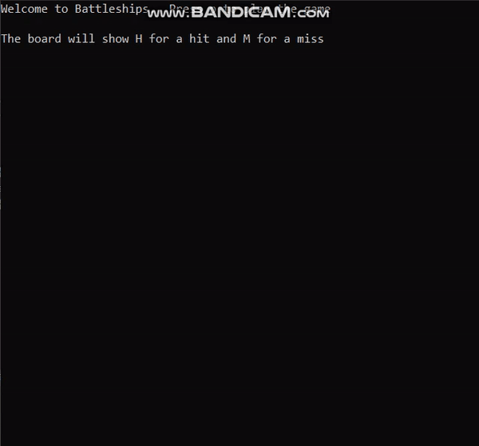
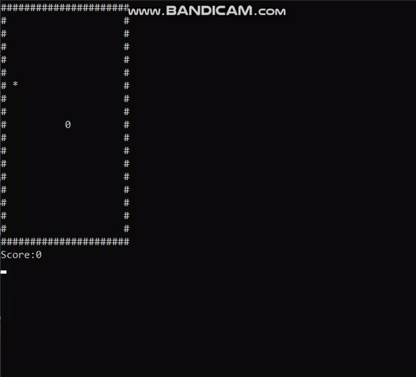
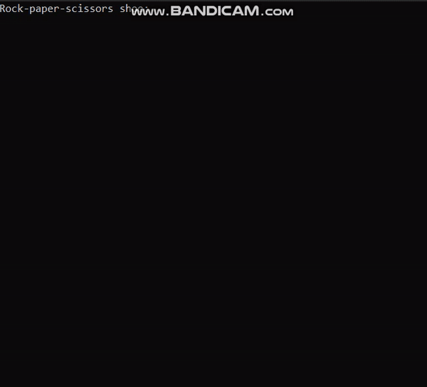
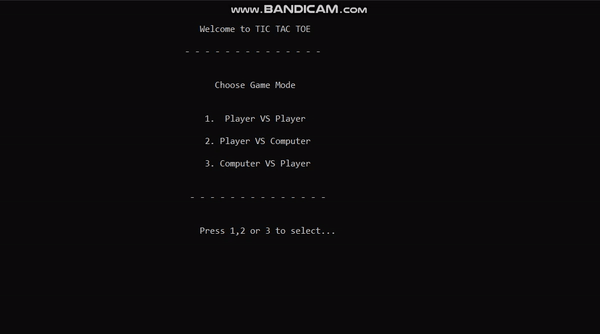

# C-plus-plus-Projects
This repository contain the console based game I made using C++

<h2>1.Battleship</h2> 
<b>This is a single player battleship game where player has to guess the positions of different types of ships in a board</b>  

<h2> 2. Snake Game</h2>
<b>The classic single player snake game made using C++ where the snake will grow larger as long as he keeps on consuming the food which will be spawned randomly at different locations</b>  

<h2>3. Rock Paper Scissors Game</h2>
<b>This is a two player game where the player plays against computer whose moves will be random</b>  

<h2>4. Tic Tac Toe</h2>
<b>The classic pen paper game. There are 3 modes in this game.</b>  
<b>a. Player VS Player</b>  
<b>b. Player VS Computer</b>  
<b>c. Computer VS Player</b>  

<b>The minimax algorithm was implemented to create an unbeatable AI. You can either Tie or Lose the match if you play against AI</b>  

